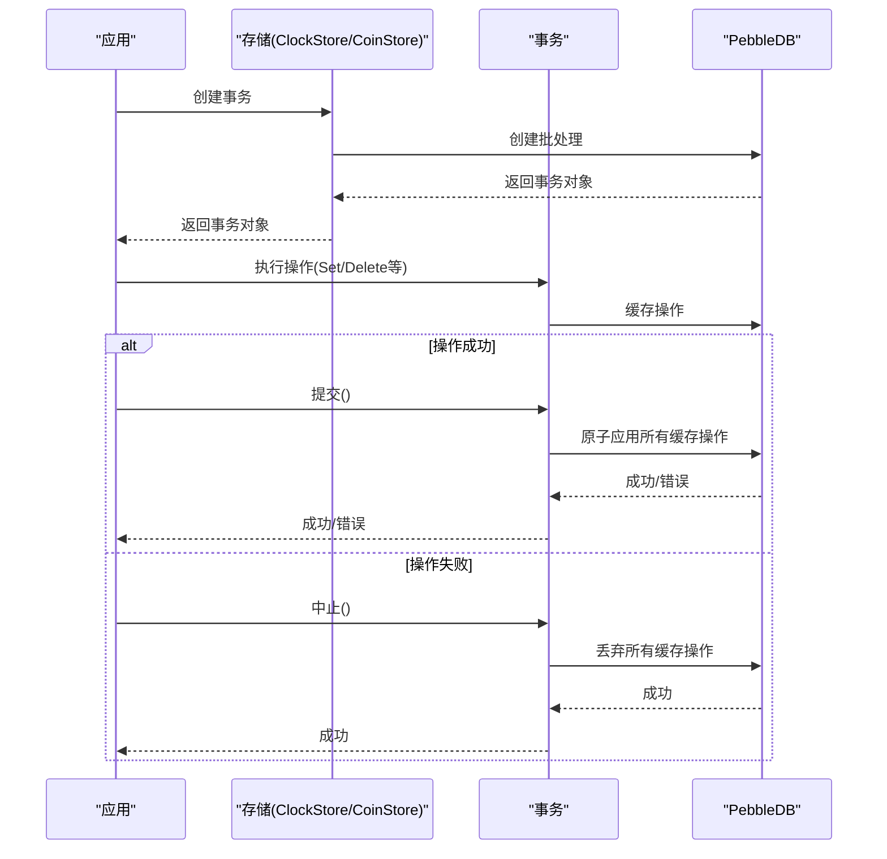

# Quilibrium的事务回滚机制

是的，Quilibrium确实有事务回滚机制。根据代码库中的信息，Quilibrium使用基于PebbleDB的事务系统，它支持事务的提交和回滚功能。

## 事务基础架构

Quilibrium的事务系统主要通过`Transaction`接口实现，该接口定义在`node/store/pebble.go`文件中： [1](#1-0) 

这个接口定义了几个关键方法：
- `Commit()` - 提交事务中的所有更改
- `Abort()` - 回滚（中止）事务中的所有更改

`PebbleTransaction`结构体实现了这个接口，它是对PebbleDB批处理操作的封装： [2](#1-1) 

特别是`Abort()`方法提供了回滚功能： [3](#1-2) 

## 事务使用模式

在Quilibrium中，事务通常按照以下模式使用：

1. 创建新事务
2. 执行一系列操作（读取、写入、删除等）
3. 如果所有操作成功，则提交事务
4. 如果出现错误，则中止（回滚）事务

这种模式在多个组件中都有体现，例如在Token执行引擎中： [4](#1-3) 

在这个例子中，如果出现错误，事务会被中止（`txn.Abort()`），所有更改都会被回滚。

## 具体回滚场景

以下是一些具体的回滚场景：

### 1. 数据帧处理错误时的回滚

在处理数据帧时，如果出现错误，系统会回滚事务： [5](#1-4) 

### 2. 删除数据帧范围时的错误处理

在删除数据帧范围的操作中，如果出现错误，系统会回滚事务： [6](#1-5) 

### 3. 令牌操作中的事务管理

在令牌（Token）系统的测试中，可以看到完整的事务生命周期，包括创建、操作和提交/回滚： [7](#1-6) 

## 存储系统中的事务支持

根据Quilibrium的存储系统wiki页面，整个存储架构都支持事务操作：

## 总结

Quilibrium确实有完善的事务回滚机制，主要通过以下方式实现：

1. 基于PebbleDB的事务接口，提供`Commit()`和`Abort()`方法
2. 在各种操作中使用事务包装，确保数据一致性
3. 错误处理中包含事务回滚逻辑
4. 支持原子操作，确保要么所有更改都应用，要么全部回滚

这种事务机制确保了在出现错误或需要撤销操作时，系统状态能够保持一致性。

Notes:
- 事务回滚机制主要用于存储层操作，包括ClockStore和CoinStore
- 回滚操作通过Transaction接口的Abort()方法实现
- 事务系统基于PebbleDB的批处理功能
- 在错误处理和异常情况下，系统会自动回滚事务以保持数据一致性

Wiki pages you might want to explore:
- [Token System (QuilibriumNetwork/ceremonyclient)](/wiki/QuilibriumNetwork/ceremonyclient#5)
- [Storage Systems (QuilibriumNetwork/ceremonyclient)](/wiki/QuilibriumNetwork/ceremonyclient#6)