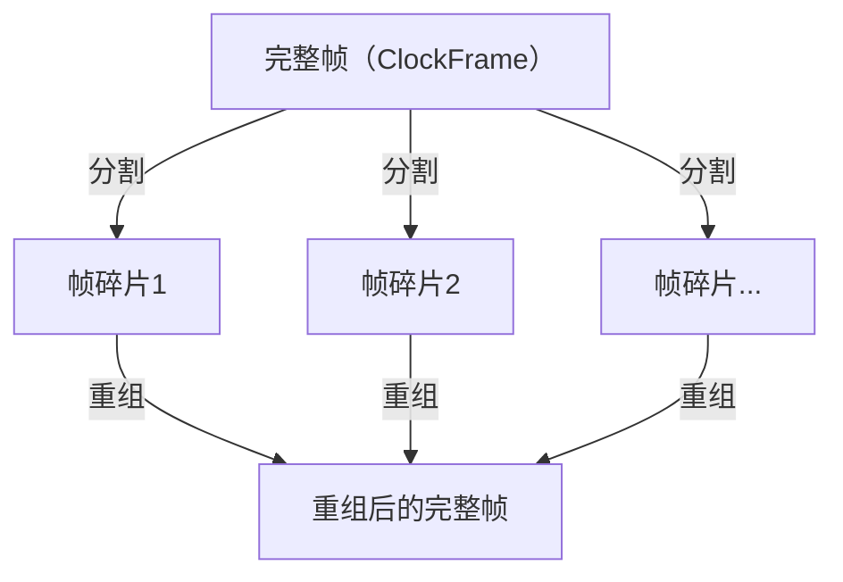
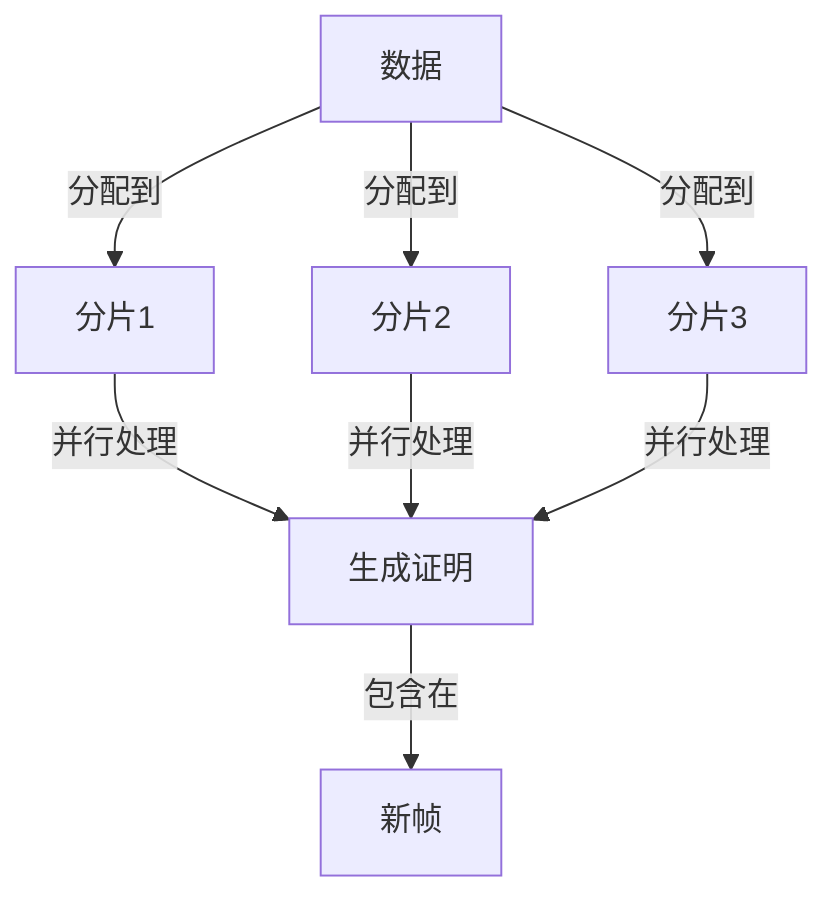

# Quilibrium中帧（frame）和分片（shard）的关联关系

在Quilibrium网络中，帧（frame）和分片（shard）有两种主要的关联关系：

## 1. 帧的碎片化传输

帧（ClockFrame）是Quilibrium网络中共识的基本单位，包含了状态更新和交易数据。为了高效传输这些可能很大的帧，系统将它们分割成更小的碎片（ClockFrameFragment）：

- 帧碎片使用Reed-Solomon编码，允许即使某些碎片丢失也能恢复完整帧 [1](#0-0) 
- 每个碎片包含元数据（如帧号、过滤器、时间戳和帧哈希）以及数据分片 [2](#0-1) 
- 这些碎片在网络中传输后可以被重新组装成完整的帧 [3](#0-2) 

## 2. 数据的分片处理

Quilibrium将数据分散到多个分片中进行处理和存储：

- 数据分片由ShardAddress和ShardKey结构定义，用于确定数据属于哪个分片 [4](#0-3) 
- 数据被分配到特定分片的过程使用了从应用地址和数据地址派生的布隆过滤器索引 [5](#0-4) 
- DataClockConsensusEngine使用多个工作分片并行生成证明 [6](#0-5) 

## 帧和分片的协作

在共识过程中，这两个概念共同工作：

1. 帧表示网络状态的完整更新，按序号连续排列
2. 大型帧被分割成碎片以便网络传输
3. 帧内的数据被分配到多个工作分片进行并行处理
4. DataTimeReel维护帧序列，并跟踪它们与数据分片的关系 [7](#0-6) 

## 总结

在Quilibrium中，帧是逻辑上的共识单位和状态更新单位，而分片有双重作用：一方面用于将大型帧分割成较小的网络传输单位，另一方面用于将数据分散到多个工作节点进行并行处理。这种设计实现了网络传输和数据处理的高效率。

Notes:
- 帧是Quilibrium共识系统的基本单位，分为主时钟帧（MasterClockFrame）和数据时钟帧（DataClockFrame）
- 分片既指网络传输中的帧碎片，也指数据处理中的数据分区
- Reed-Solomon编码用于帧的碎片化和重组，保证数据传输的可靠性
- 数据分片处理通过多个工作节点并行进行，提高处理效率
